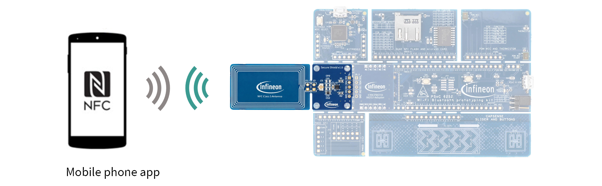
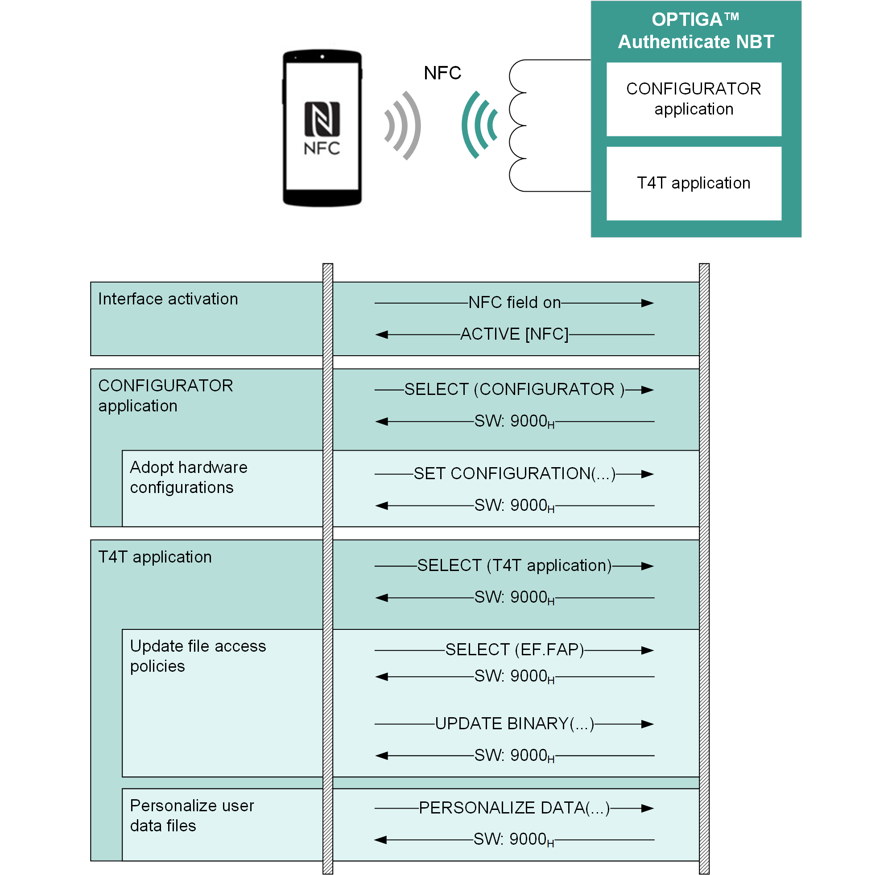
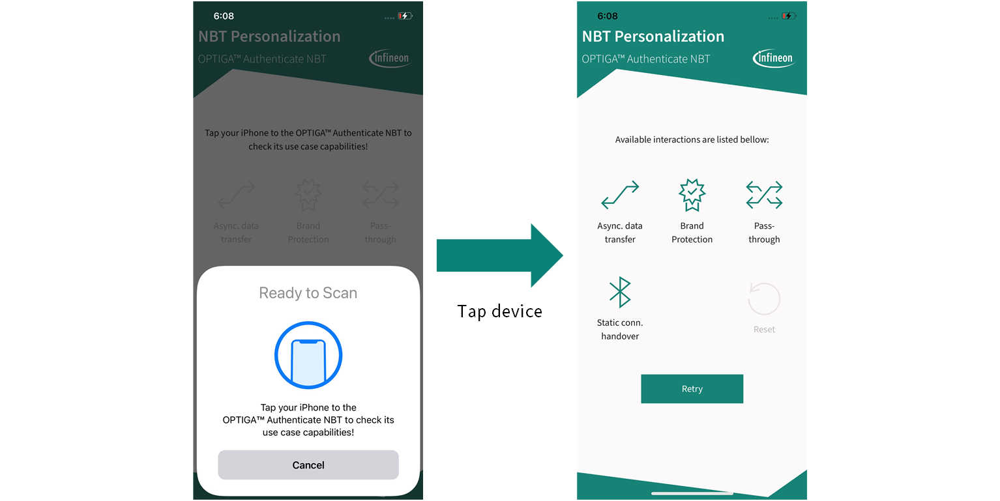
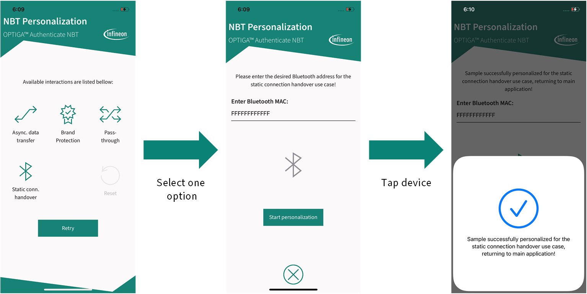

<!--
SPDX-FileCopyrightText: 2024 Infineon Technologies AG
SPDX-License-Identifier: MIT
-->

# OPTIGA™ Authenticate NBT PERSO Application for iOS

This is the *NBT Personalization* mobile phone app, a Swift-based *Xcode* project which demonstrates the *personalization of the OPTIGA™ Authenticate NBT via NFC (PERSO)*.

## Overview

The example application enables an iPhone to perform the personalization of the OPTIGA™ Authenticate NBT for the reference use cases provided by Infineon Technologies with pre-defined configurations.
This implementation is not intended to perform any specific use case on its own, however, it allows the user to prepare a sample for a specific usage. Simultaneously, it provides an example on how to use the [OPTIGA™ Authenticate NBT Host Library for Swift](https://github.com/infineon/optiga-nbt-lib-swift) in iOS applications for personalization purposes.

The application is intended to personalize the OPTIGA™ Authenticate NBT samples for four different use cases:

- *Host parameterization via asynchronous data transfer*
- *Host parameterization via pass-through*
- *Brand protection*
- *Static connection handover*

These use cases are described in detail (including their personalization steps) in dedicated Use Case Guides, available on the [OPTIGA™ Authenticate NBT - product page](https://www.infineon.com/OPTIGA-Authenticate-NBT). Also refer to the [OPTIGA™ Authenticate NBT - GitHub overview](https://github.com/Infineon/optiga-nbt) for an overview of the available host software for the OPTIGA™ Authenticate NBT.

### Features

- iOS application with user interface and NFC communication capability
- Example implementation to personalize the OPTIGA™ Authenticate NBT
- Sample usage of the [OPTIGA™ Authenticate NBT Host Library for Swift](https://github.com/infineon/optiga-nbt-lib-swift) (version 1.1.1)

## Getting started

Information on how to setup and use this example application for the *personalization of the OPTIGA™ Authenticate NBT via NFC*.

### Requirements

- NFC-enabled iOS device running iOS 15 or higher
- [OPTIGA™ Authenticate NBT Development Kit](https://www.infineon.com/OPTIGA-Authenticate-NBT-Dev-Kit) or [OPTIGA™ Authenticate NBT Development Shield](https://www.infineon.com/OPTIGA-Authenticate-NBT-Dev-Shield)
- *NBT Personalization* mobile phone app ([iOS](https://github.com/Infineon/optiga-nbt-example-perso-ios) - **\*this application\*** or [Android](https://github.com/Infineon/optiga-nbt-example-perso-android))
  - Mobile phone example application for the *personalization of the OPTIGA™ Authenticate NBT via NFC*
  - To configure the OPTIGA™ Authenticate NBT for the desired use case or to reset it to its delivery condition

### Setup

This project is shared to be loaded and compiled using *Xcode*. To do this, it is sufficient to download and import the project into *Xcode* (by selecting File --> Open).

The mobile phone app needs to be installed on the mobile phone

- For installing Android applications, it is recommended to use *Android Studio*
- For installing iOS applications, it is recommended to use *Xcode*

### Usage

To perform *personalization of the OPTIGA™ Authenticate NBT via NFC*:

- Make sure that NFC is enabled on the iOS device
- Launch the *NBT Personalization* mobile phone app
- Tap the OPTIGA™ Authenticate NBT to the NFC antenna of the mobile phone
- Select the OPTIGA™ Authenticate NBT use case to be personalized
- Once again, tap the OPTIGA™ Authenticate NBT to the mobile phone to run the personalization

## Personalization flow

The personalization procedure is intended to handle all necessary steps to configure the OPTIGA™ Authenticate NBT interfaces, files and access conditions to support and fit to a specific use case.
A generic overview with the most essential steps of the personalization is shown in the next figure. The exact configuration of each use case is described in the dedicated Use Case Guide on the [OPTIGA™ Authenticate NBT - product page](https://www.infineon.com/OPTIGA-Authenticate-NBT).

## Graphical User Interface (GUI)

After the start-up, the user needs to present the OPTIGA™ Authenticate NBT to the mobile phone by tapping its antenna to the NFC antenna of the phone. Depending on the current state of the OPTIGA™ Authenticate NBT, the application will allow further steps.
If the OPTIGA™ Authenticate NBT is in the default state, the GUI will allow the user to choose between the personalization of the following four use cases:

- *Host parameterization via asynchronous data transfer*
- *Host parameterization via pass-through*
- *Brand protection*
- *Static connection handover*

The associated example applications for these use cases can be found on the [OPTIGA™ Authenticate NBT - GitHub overview](https://github.com/Infineon/optiga-nbt).

If the OPTIGA™ Authenticate NBT is already personalized, it will provide the user with the possibility to reset the OPTIGA™ Authenticate NBT to its default state.

After selecting any one of the configurations, the application will run the personalization as soon as the user taps the OPTIGA™ Authenticate NBT to the mobile phone. Depending on the use case, the user needs to enter some additional information, such as a link to the COTT server for the *brand protection* use case. The successful configuration will be communicated to the user via the user interface.

Example when selecting the *static connection handover* use case:

The user can always return to the `HomeView` by pressing the "Return" button on the bottom of the screen.

## High-level application flow

The first view to be started is the `HomeView`, showing a main menu where the user can select a use case configuration. Based on the selection, a new view is started (for example, the `BrandProtectionView` to run the *brand protection*-specific personalization).

As soon as the personalization is triggered by tapping the antenna of the OPTIGA™ Authenticate NBT device to the mobile phone, a use case-specific method of `NbtUseCaseManager` is called (for example, the `configureBPUseCase()`, which is representing the *brand protection* use case configuration). Each use case has a corresponding method in `NbtUseCaseManager` that holds all essential configurations such as a `FileAccessPolicy` for each file or certain interface configurations. The personalization itself is started by calling the use case specific configuration method of the `NbtUseCaseManager` class (for example, `configureBPUseCase()`).

Finally, there is also a NDEF file handler interface (`INdefHandler`) providing two ways of handling the NDEF file content. The `IOSHandler` is using libraries provided by iOS itself, and the `InfineonHandler` is using the libraries provided by Infineon. In both cases ,the methods `createConnectionHandoverNdefMessage()` or `createBrandprotectionNdefMessage()` are provided.

## Additional information

### Related resources

- [OPTIGA™ Authenticate NBT - product page](https://www.infineon.com/OPTIGA-Authenticate-NBT)
- [OPTIGA™ Authenticate NBT - GitHub overview](https://github.com/Infineon/optiga-nbt)

### Contributing

Please read [CONTRIBUTING.md](CONTRIBUTING.md) for detailed contribution instructions and refer to our [CODE_OF_CONDUCT.md](CODE_OF_CONDUCT.md).

### Contact

In case of questions regarding this repository and its contents, refer to [MAINTAINERS.md](MAINTAINERS.md) for the contact details of this project's maintainers.

## Licensing

Please see our [LICENSE](LICENSE) for copyright and license information.

This project follows the [REUSE](https://reuse.software/) approach, so copyright and licensing information is available for every file (including third party components) either in the file header, an individual *.license file or the .reuse/dep5 file. All licenses can be found in the [LICENSES](LICENSES) folder.
